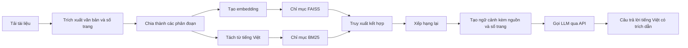

<div align="center">

# learnbot_ai

Trợ lý hỏi đáp tài liệu tiếng Việt dựa trên RAG

Tiếng Việt | [English](README_EN.md)

[](https://github.com/CaoRIV/learnbot_ai/actions/workflows/ci.yml)
[](LICENSE)
[](https://www.python.org/)

</div>

`learnbot_ai` giúp người dùng đặt câu hỏi bằng tiếng Việt và nhận câu trả lời dựa trên nội dung tài liệu đã tải lên. Dự án sử dụng FAISS kết hợp BM25 để truy xuất, có bước xếp hạng lại kết quả và gọi mô hình ngôn ngữ qua API để tạo câu trả lời kèm nguồn và số trang.

Dự án được phát triển từ [weiwill88/Local_Pdf_Chat_RAG](https://github.com/weiwill88/Local_Pdf_Chat_RAG), sau đó được điều chỉnh cho tài liệu tiếng Việt và loại bỏ việc chạy LLM cục bộ.

> Đây là dự án phục vụ học tập và thử nghiệm, chưa phải một dịch vụ kho tri thức sẵn sàng cho môi trường vận hành thực tế. Trước khi dùng với dữ liệu thực tế, nên bổ sung xác thực, phân quyền, lưu trữ bền vững, đánh giá chất lượng, kiểm toán bảo mật và cơ chế bảo vệ dữ liệu.

## Tính năng chính

- **Hỏi đáp dựa trên tài liệu**: chỉ sử dụng nội dung truy xuất được để trả lời; nói rõ khi tài liệu không có thông tin.
- **Trích dẫn có cấu trúc**: API trả tên tài liệu, trang, chunk ID và điểm retrieval trực tiếp từ metadata chỉ mục; câu trả lời từ PDF vẫn dùng định dạng `[Tên tài liệu, trang X]`.
- **Lọc bằng chứng theo độ liên quan**: chỉ các chunk đạt `MIN_RELEVANCE_SCORE` mới được đưa vào context và citation.
- **Từ chối khi thiếu bằng chứng**: không gọi bước sinh câu trả lời nếu không còn context đạt ngưỡng; API trả trạng thái có cấu trúc thay vì để LLM suy đoán.
- **Đối chiếu ngay trong giao diện**: mỗi câu trả lời hiển thị tên nguồn, trang, chunk ID, điểm liên quan và liên kết web từ citation có cấu trúc.
- **Truy xuất kết hợp**: kết hợp tìm kiếm vector bằng FAISS và tìm kiếm từ khóa bằng BM25.
- **Chỉ mục bền vững**: tự lưu và khôi phục FAISS/BM25 khi khởi động, không embedding lại các chunk cũ khi thêm tài liệu.
- **Đo chất lượng retrieval**: benchmark tiếng Việt có nhãn, đo Recall@5, MRR và độ trễ mà không gọi LLM API.
- **Tối ưu cho tiếng Việt**: BM25 tách từ bằng `underthesea` thay vì tokenizer tiếng Trung.
- **Xếp hạng lại kết quả**: hỗ trợ CrossEncoder hoặc chấm điểm liên quan qua LLM API.
- **Nhiều dịch vụ LLM**: chọn SiliconFlow, OpenAI hoặc Gemini qua biến `LLM_PROVIDER`.
- **Không chạy LLM cục bộ**: không phụ thuộc Ollama hoặc llama.cpp; embedding và reranker vẫn có thể chạy trên máy.
- **Nhiều định dạng tài liệu**: hỗ trợ PDF, TXT, Markdown, DOCX, XLS/XLSX và PPTX.
- **Hai cách sử dụng**: giao diện Gradio và REST API bằng FastAPI.

## Luồng xử lý RAG



## Bắt đầu nhanh

### 1. Tải mã nguồn

```bash
git clone https://github.com/CaoRIV/learnbot_ai.git
cd learnbot_ai
```

### 2. Tạo môi trường Python

Dự án yêu cầu Python 3.10 trở lên.

Trên Windows PowerShell:

```powershell
python -m venv .venv
.\.venv\Scripts\Activate.ps1
python -m pip install --upgrade pip
pip install -r requirements.txt
```

Trên Linux hoặc macOS:

```bash
python3 -m venv .venv
source .venv/bin/activate
python -m pip install --upgrade pip
pip install -r requirements.txt
```

### 3. Cấu hình dịch vụ LLM

Tạo `.env` từ file mẫu.

Trên Windows PowerShell:

```powershell
Copy-Item example.env .env
```

Trên Linux hoặc macOS:

```bash
cp example.env .env
```

Mở `.env`, đặt `LLM_PROVIDER` thành một trong ba giá trị sau và điền API key tương ứng:

| Giá trị `LLM_PROVIDER` | Biến API key |
| --- | --- |
| `siliconflow` | `SILICONFLOW_API_KEY` |
| `openai` | `OPENAI_API_KEY` |
| `gemini` | `GEMINI_API_KEY` |

Không đưa API key thật lên Git. Các giá trị mẫu bắt đầu bằng `Your_` không được xem là thông tin xác thực hợp lệ.

### 4. Khởi động giao diện Next.js

Giao diện chính mới sử dụng Next.js và kết nối với FastAPI. Mở hai cửa sổ PowerShell.

Cửa sổ thứ nhất — backend:

```powershell
.\.venv\Scripts\Activate.ps1
python -m uvicorn api_router:app --host 127.0.0.1 --port 17995
```

Cửa sổ thứ hai — frontend:

```powershell
cd frontend
pnpm install
pnpm dev
```

Mở `http://127.0.0.1:3000`. Nếu backend chạy ở địa chỉ khác, sao chép `frontend/.env.local.example` thành `frontend/.env.local` rồi cập nhật `NEXT_PUBLIC_API_BASE_URL`.

### 5. Khởi động giao diện Gradio

Giao diện Gradio được giữ lại để chạy nhanh chỉ với Python:

```bash
python rag_demo.py
```

Ứng dụng ưu tiên địa chỉ `http://127.0.0.1:17995`. Nếu cổng này đang được sử dụng, ứng dụng sẽ lần lượt thử các cổng từ 17996 đến 17999.

Quy trình sử dụng:

1. Chọn một hoặc nhiều tài liệu.
2. Nhấn **Xử lý tài liệu** và chờ quá trình lập chỉ mục hoàn tất.
3. Nhập câu hỏi bằng tiếng Việt.
4. Chọn dịch vụ LLM rồi nhấn **Gửi câu hỏi**.

### 6. Khởi động REST API

```bash
python api_router.py
```

Các endpoint chính:

| Phương thức | Endpoint | Chức năng |
| --- | --- | --- |
| `GET` | `/api/status` | Kiểm tra trạng thái ứng dụng và cấu hình dịch vụ LLM |
| `POST` | `/api/upload` | Tải lên và xử lý tài liệu |
| `POST` | `/api/ask` | Đặt câu hỏi dựa trên tài liệu đã xử lý |

`POST /api/ask` trả cả `citations` có cấu trúc và `sources` theo định dạng cũ để
frontend hiện tại tiếp tục tương thích. Citation không được bóc từ nội dung do
LLM sinh ra mà lấy trực tiếp từ metadata của kết quả retrieval:

`answer_status` có một trong bốn giá trị: `answered`, `insufficient_evidence`,
`empty_knowledge_base` hoặc `error`.

Giao diện Next.js dùng trực tiếp `citations` để hiển thị nguồn dưới từng câu trả
lời và trong panel nguồn gần nhất. Nguồn web chỉ mở liên kết HTTP/HTTPS; nguồn
cục bộ hiển thị trang, chunk ID và điểm liên quan để người dùng đối chiếu.

```json
{
  "answer": "...",
  "answer_status": "answered",
  "citations": [
    {
      "document": "giao-trinh.pdf",
      "page": 7,
      "chunk_id": "document-id:7:0",
      "score": 0.875,
      "type": "document",
      "url": null
    }
  ],
  "sources": [
    {"type": "Tài liệu cục bộ", "source": "giao-trinh.pdf", "page": 7}
  ],
  "metadata": {
    "enable_web_search": false,
    "model": "siliconflow",
    "citation_count": 1,
    "min_relevance_score": 0.35
  }
}
```

## Cấu trúc dự án

```text
├── config.py                  # Biến môi trường, mô hình và tham số RAG
├── rag_demo.py                # Giao diện Gradio
├── api_router.py              # REST API bằng FastAPI
├── frontend/                  # Giao diện Next.js + TypeScript
│   ├── src/app/               # App Router, metadata và design tokens
│   ├── src/components/        # Workspace hội thoại và icon SVG
│   └── src/lib/api.ts         # Lớp kết nối FastAPI có kiểu dữ liệu
├── design-system/             # Quy chuẩn UI/UX và page override
├── llm_provider.py            # Lớp kết nối SiliconFlow/OpenAI/Gemini
├── migrations/                # Migration schema SQLite có phiên bản
├── benchmarks/                # Dataset, lệnh benchmark và baseline retrieval
├── core/
│   ├── document_loader.py     # Trích xuất nội dung và số trang
│   ├── evidence.py            # Contract bằng chứng và citation có cấu trúc
│   ├── text_splitter.py       # Chia văn bản thành các phân đoạn
│   ├── embeddings.py          # Tạo vector embedding
│   ├── index_snapshot.py      # Lưu, kiểm tra và khôi phục snapshot FAISS/BM25
│   ├── storage.py             # Repository SQLite cho tài liệu và metadata
│   ├── vector_store.py        # Quản lý chỉ mục FAISS
│   ├── bm25_index.py          # Tách từ tiếng Việt và chỉ mục BM25
│   ├── retriever.py           # Truy xuất kết hợp và truy xuất đệ quy
│   ├── reranker.py            # Xếp hạng lại kết quả
│   └── generator.py           # Tạo ngữ cảnh, prompt và câu trả lời
├── features/                  # Tìm kiếm web, phát hiện xung đột và tiện ích mở rộng
├── tests/                     # Kiểm thử không cần API key thật
└── .github/                   # Cấu hình CI và các biểu mẫu GitHub
```

## Kiểm thử

Cài các thư viện dành cho phát triển:

```bash
pip install -r requirements-dev.txt
```

Chạy toàn bộ test trên Windows PowerShell:

```powershell
$env:PYTEST_DISABLE_PLUGIN_AUTOLOAD = "1"
python -m pytest
```

Trên Linux hoặc macOS:

```bash
PYTEST_DISABLE_PLUGIN_AUTOLOAD=1 python -m pytest
```

Bộ test bao gồm:

- cấu hình và lựa chọn dịch vụ LLM mặc định;
- lời gọi API khi có hoặc thiếu thông tin xác thực;
- trích xuất tài liệu và metadata số trang PDF;
- bộ tách từ tiếng Việt cho BM25;
- truy xuất BM25, FAISS và hợp nhất kết quả;
- migration, transaction và chống nhập trùng trong kho SQLite;
- lưu/khôi phục snapshot, kiểm tra checksum/model và rollback khi lỗi;
- prompt giới hạn câu trả lời trong nội dung tài liệu;
- citation có cấu trúc lấy từ metadata retrieval, không phân tích từ văn bản LLM;
- dataset benchmark, metrics retrieval và bảo toàn metadata nguồn/trang.

GitHub Actions sẽ biên dịch mã Python và chạy test cho mỗi Pull Request.

## Benchmark retrieval tiếng Việt

Dataset mặc định có 24 câu hỏi với chunk, tài liệu và trang đúng. Benchmark xây
index riêng, không gọi LLM API hoặc tìm kiếm web.

Chạy BM25, FAISS và hybrid retrieval:

```powershell
python -m benchmarks.retrieval_benchmark --methods bm25,faiss,hybrid --top-k 5
```

Nếu model embedding đã có trong cache, có thể chặn hoàn toàn truy cập mạng:

```powershell
python -m benchmarks.retrieval_benchmark --methods bm25,faiss,hybrid --top-k 5 --offline
```

Thêm `hybrid_rerank` vào `--methods` để đo CrossEncoder cục bộ. Dùng
`--fail-under-recall 0.8` nếu muốn lệnh trả mã lỗi khi một phương pháp không đạt
ngưỡng. Báo cáo JSON chi tiết và Markdown tóm tắt được ghi vào
`benchmarks/results/`. Baseline hiện tại nằm tại
[`benchmarks/baselines/v2.3.0.md`](benchmarks/baselines/v2.3.0.md).

## Biến môi trường

Xem đầy đủ tại [`example.env`](example.env). Các biến thường dùng:

| Biến | Mục đích |
| --- | --- |
| `LLM_PROVIDER` | Chọn `siliconflow`, `openai` hoặc `gemini` |
| `SILICONFLOW_API_KEY` | API key của SiliconFlow |
| `SILICONFLOW_MODEL_NAME` | ID mô hình SiliconFlow |
| `OPENAI_API_KEY` | API key của OpenAI |
| `OPENAI_API_URL` | URL tương thích OpenAI Chat Completions |
| `OPENAI_MODEL_NAME` | ID mô hình OpenAI |
| `GEMINI_API_KEY` | API key của Gemini |
| `GEMINI_API_URL` | URL cơ sở của Gemini API |
| `GEMINI_MODEL_NAME` | ID mô hình Gemini |
| `SERPAPI_KEY` | API key tùy chọn cho tìm kiếm web |
| `RERANK_METHOD` | Chọn `cross_encoder` hoặc `llm` |
| `EMBED_MODEL_NAME` | Model embedding dùng cho FAISS và benchmark |
| `RERANK_MODEL_NAME` | Model CrossEncoder dùng để xếp hạng lại |
| `MIN_RELEVANCE_SCORE` | Ngưỡng điểm rerank 0–1 để đưa bằng chứng cục bộ vào context, mặc định `0.35` |
| `DATABASE_PATH` | Đường dẫn file SQLite, mặc định `data/learnbot.db` |
| `INDEX_DIRECTORY` | Thư mục snapshot FAISS/BM25, mặc định `data/indexes` |

Ứng dụng không yêu cầu `OLLAMA_HOST` và không gọi Ollama.

## Giới hạn hiện tại

- PDF chỉ được đọc từ lớp văn bản, chưa tích hợp OCR tổng quát; tài liệu scan cần được OCR trước.
- Việc đọc Excel và PowerPoint tập trung vào nội dung chữ, không giữ nguyên bố cục trực quan.
- Các snapshot không còn hoạt động hiện được giữ lại để phục hồi thủ công, nên thư mục chỉ mục có thể tăng dần sau nhiều lần nhập tài liệu.
- Mô hình embedding hoặc reranker cục bộ có thể cần tải dữ liệu trong lần chạy đầu tiên.
- Câu hỏi gửi tới LLM và dịch vụ tìm kiếm web có thể được chuyển cho bên thứ ba; cần xem xét phạm vi dữ liệu trước khi sử dụng tài liệu nhạy cảm.
- Máy có 8 GB RAM nên xử lý từng nhóm tài liệu nhỏ để tránh sử dụng quá nhiều bộ nhớ.
- Dataset benchmark ban đầu có quy mô nhỏ và mang tính kiểm tra hồi quy; chưa đại diện đầy đủ cho mọi miền tài liệu thực tế.
- Ngưỡng liên quan mặc định là điểm khởi đầu thận trọng; nên hiệu chỉnh bằng benchmark trên tài liệu thực tế. Nguồn web hiện chưa có điểm rerank nên vẫn được giữ khi người dùng chủ động bật tìm kiếm web.

## Đóng góp

Bạn có thể gửi báo cáo lỗi có thể tái hiện, cải thiện tài liệu hoặc Pull Request tập trung vào một thay đổi cụ thể. Trước khi đóng góp, hãy đọc [`CONTRIBUTING.md`](CONTRIBUTING.md) và [`CODE_OF_CONDUCT.md`](CODE_OF_CONDUCT.md).

Không tạo Issue công khai cho lỗ hổng bảo mật. Hãy làm theo quy trình trong [`SECURITY.md`](SECURITY.md).

## Phiên bản và bảo trì

- Lịch sử thay đổi: [`CHANGELOG.md`](CHANGELOG.md)
- Các phiên bản đã phát hành: [GitHub Releases](https://github.com/CaoRIV/learnbot_ai/releases)
- Dự án gốc: [weiwill88/Local_Pdf_Chat_RAG](https://github.com/weiwill88/Local_Pdf_Chat_RAG)

## Giấy phép

Dự án được phát hành theo [giấy phép MIT](LICENSE).
